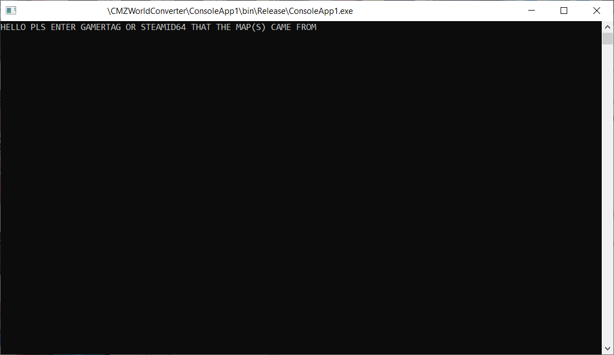

# CMZ360ToPCWorldConverter

CMZ360ToPCWorldConverter is a small CastleMiner Z utility for copying encrypted Xbox 360 / older-style world save files from a local `Worlds` folder into an unprotected `OutputWorlds` folder that the PC version can attempt to load.

This project is best understood as a **save decryption/import helper**, not a full world-upgrade tool.



## What the converter does

When run, the converter:

1. Prompts for the original owner identifier: either an Xbox gamertag or a SteamID64.
2. Builds the CastleMiner Z save key using the entered value plus the original `CMZ778` suffix.
3. Recursively reads encrypted files from the local `Worlds` folder.
4. Writes unprotected copies to matching paths under `OutputWorlds`.
5. If the entered value looks like a gamertag instead of a SteamID64, patches each converted `world.info` file with a small PC-compatibility header and blank PC server fields.

## What the converter does not do

This tool does **not** fully upgrade a world to the latest CastleMiner Z world format.

CastleMiner Z for PC already contains compatibility logic for older world-info and chunk formats. After this converter makes a world readable, the PC game should handle the real upgrade when the world is loaded and saved normally.

This tool also does **not** extract saves directly from an Xbox 360 device, profile, or storage container. You need to provide the world files/folders yourself.

## Project layout

```text
CMZ360ToPCWorldConverter/
├─ BuildRelease.bat
├─ LICENSE
├─ README.md
└─ CMZ360ToPCWorldConverter/
   ├─ CMZ360ToPCWorldConverter.csproj
   ├─ Program.cs
   ├─ Properties/
   │  └─ AssemblyInfo.cs
   ├─ ReferenceAssemblies/
   │  └─ DNA.Common.dll
   ├─ WorldData/
   │  └─ WorldInfo.cs
   └─ _Images/
      └─ Preview.png
```

Runtime folders are created in the program's current working directory:

```text
Worlds/        Put the original encrypted world files here.
OutputWorlds/  Converted files are written here.
```

When running the built executable directly, place `Worlds` beside the executable. When running from Visual Studio, the current working directory is usually the build output folder.

## Usage

1. Back up the original world files and your current PC CastleMiner Z save folder.
2. Build the project or download/run a release build.
3. Create a folder named `Worlds` in the program's working directory.
4. Copy the source world folder/files into `Worlds`.
5. Run `CMZ360ToPCWorldConverter.exe`.
6. Enter the original gamertag or SteamID64 when prompted.
7. Check `OutputWorlds` for the converted files.
8. Copy the converted world to the appropriate PC save location and let the game load/save it normally.

If the world already appears and loads correctly in the PC game, this converter is probably unnecessary.

## Gamertag vs SteamID64 behavior

The converter preserves the original project's simple owner-ID check:

- Values shorter than 17 characters are treated as gamertag-style input.
- 17-character values are treated as SteamID64-style input.

Gamertag-style input also triggers the `world.info` compatibility patch. SteamID64-style input only performs the decrypt/copy step.

The entered value must match the value originally used to protect the save. A wrong value usually causes load failures or corrupt output.

## Build notes

The project targets **.NET Framework 4.8** and builds as **x86**.

The project references:

```text
CMZ360ToPCWorldConverter/ReferenceAssemblies/DNA.Common.dll
```

Use the PC/Steam version of `DNA.Common.dll` that matches the CastleMiner Z version you are targeting. Do not replace it with an Xbox 360 assembly.

You can build the project directly with Visual Studio/MSBuild, or use:

```bat
BuildRelease.bat
```

The release script searches for MSBuild through `vswhere`, rebuilds the project in `Release|x86`, stages the compiled output with `README.md` and `LICENSE`, and creates a release zip under:

```text
Build/Release/
```

## Source organization

- `Program.cs` contains the console entry point, owner-ID prompt, recursive file scanning, and encrypted-to-unprotected save copy logic.
- `WorldData/WorldInfo.cs` contains the lightweight `world.info` wrapper used for the minimal compatibility patch.
- `ReferenceAssemblies/DNA.Common.dll` is kept separate from source files so the external game dependency is easy to identify.
- `_Images/Preview.png` contains the README preview image.

The code intentionally keeps the converter small and close to the original behavior. Comments and regions are used to explain the risky parts without changing the save logic.

## Important notes

- Always keep backups before converting or copying worlds into your real PC save folder.
- This converter writes to `OutputWorlds`; it does not directly modify the original files in `Worlds`.
- The `world.info` patch is intentionally minimal. It rewrites a compatibility header and appends blank server message/password fields, but it does not rebuild a full modern `world.info`.
- The PC game should perform the actual world upgrade after it successfully loads and saves the converted world.
- Converted output may still fail if the input files are incomplete, already decrypted, from a different owner ID, or from an unsupported save/container format.

## License

This project is licensed under the GNU General Public License v3.0 or later. See `LICENSE` for details.
